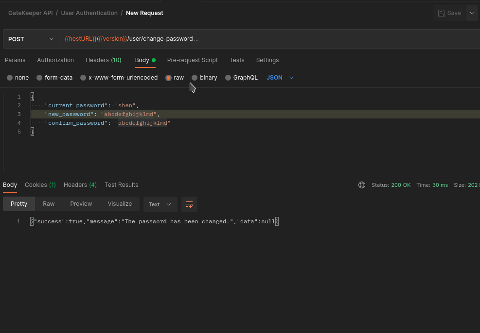

    <h1>GateKeeper</h1>
    <h4>Keep Track Of Your SSH Key Pairs<h4>

**Note: The project is currently in development**

### Sneakpeek

## 🔑 Key Features:

- User Authentication
  - Login
  - Logout
  - Change password
- SSH Key Pair Management
  - View SSH Key Pairs
  - Delete SSH Key Pairs
  - Generate SSH Key Pairs

## Contribution guide:

When commiting a change add the following tags in the message.

- feat: Add a new feature to the codebase (MINOR in semantic versioning).
- fix: Fix a bug (equivalent to a PATCH in Semantic Versioning).
- docs: Documentation changes.
- style: Code style change (semicolon, indentation...).
- refactor: Refactor code without changing public API.
- perf: Update code performances.
- test: Add test to an existing feature.
- chore: Change Outside Runtime Environment - Update something without impacting the code (ex: readme update, CI/CD update...).
